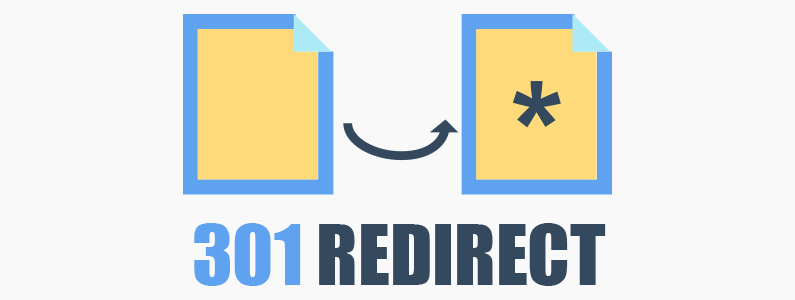

# 브릿지 리다이렉션 생성기 (Bridge Redirect Generator)

> 웹 기반 중간 브릿지를 생성해 주는 리다이렉션 생성기

## 🔗 사용방법

1. 해당 [사이트](https://coupang-partners-link-lnraqzkno.vercel.app)의 접속합니다.
2. 리다이렉션 시킬 URL을 리디렉션 생성 입력 창의 넣어줍니다.
3. 그 후 리디렉션 생성 버튼 클릭합니다.
4. 생성되는 링크를 원하는 사이트의 입력해 줍니다.
5. 사용자가 해당 링크를 클릭하게 되면 브릿지를 타고 리디렉션 되길 원하는 URL로 이동시킵니다.

## ⛔ Warning

**해당 프로그램을 사용하면서 발생하는 불이익은 일체 사용자에게 있습니다.**

## 🔥 License

MIT License
